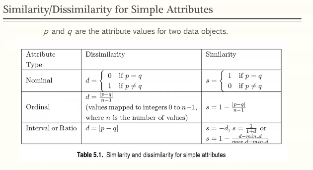
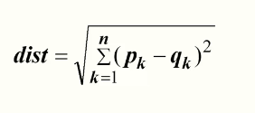

# Module 1

## What we will learn in this module

- What is data mining?
- what techniques are available?
- what does each technique do?
- What are the challenges?
- what types of data are available and what operations are applicable to each type?
- why data needs to be cleaned and how it is done
- how data is preprocessed?
- how data proximity is measured?

<u>*Note: exercise 1 due soon*</u>

## Motivations

- Data collection is easy. Companies can collect data on a massive scale by the second. 
- Data storage is cheap.
- knowledge can be extracted from data to improve decision making
- humans are *incapable* of analyzing huge amounts of data **(big data)**

### Examples

- business and industry
  - data collected about customers/purchases
    - bar code scanner
    - smart card
    - logs from websites
    - call center records
  - knowledge extracted by data mining:
    - customer profiling: if the business can answer questions about their customers, they can make smarter decisions
    - targeted marketing
    - store layout
  - data collected by online viewing
    - web browsing
    - messaging
    - social media posts
    - knowledge extracted
      - product recommendation
      - identifying spam
- science, engineering and medicine
  - data collected by
    - devices such as telescopes
    - satellite
    - patient history
  - knowledge extracted
    - exploring galaxies
    - environmental issues
    - finding cause of disease, provide better care

## What is Data Mining?

**Data mining is the process of discovering information, which is not explicitly visible.** Data mining is also able to **extract new information or patterns** which may be potentially useful. This new information may seem inconsequential from a human perspective, but data mining can extract data from seemingly unrelated data points. Data mining is **automated**, or semi-automated.

The process includes:

`understand the business <--> understand the data --> preprocess the data <--> model --> evaluate --> deploy`

### What is *not* data mining?

- searching for a thread in piazza
- finding the average grade received by undergraduate female students
- finding a country in North America, that has more than 30 million people, life expectancy >70, official language is French

**A SQL query can find the answer to all these questions!**

## The origins of data mining

- statistics
  - sampling, estimation, and hypothesis testing 
- AI/ machine learning/ pattern recognition
  - search algorithms, modeling techniques
- database systems
  - indexing and query processing

$$
Data Mining = Statistics \cap AI \cap DatabaseSystems
$$

## Data Mining Techniques

- Predictive methods
  - classification
    - decision trees
    - neural networks
    - support vector machine
    - nearest neighbors
  - regression
  - deviation detection
- Descriptive methods
  - clustering
    - K-means
    - DBSCAN
    - Hierarchical
  - association rule discovery
  - association pattern discovery

## Classification

- **Training set**: contains a set of <u>records</u> (rows) and <u>attributes</u> (columns)
- **Class variable**: an <u>attribute</u> that is to be <u>predicted</u>
- **Test Set**: a set of records, whose class variable is pretended to be unknown

- Goal: create a **model** as a:
  - function of other attributes
  - that can predict the **class variable** for previously unseen record of data

**In a nutshell: The training set is used to create the model, and the test set is used to validate the model.**

### Classification Applications

- Goal: **Fraud detection**
- training set: credit card transactions, account holder's data
- class variable: Fraudulent transaction
- class variable's value: yes or no
- create the model by training it using the training set
- use it to detect fraudulent transactions

Another example:

- Goal: **customer loyalty detection**
- training set: customer financial status, marital status, how often they call, when the call
- class variable: is loyal
- class variable value: yes or no
- create the model by training it using the training set

## Regression

- **Predictive** method
- the model is a linear or nonlinear function of the attribute that predicts the class variable
- class variable is a **continuous variable**
- examples:
  - predicting the sales amounts of new products based on advertising expenditure
  - predicting wind velocities as a function of temperature, humidity, air pressure, etc.
  - time series prediction of stock market indices

## Clustering

- A data set containing a set of attributes is given

- Goal: find clusters such that:

  - the data points in one cluster are the most similar
  - the data points in separate clusters are the most dissimilar

- a measure that is able to compute the similarity between two data points is given

- similarity measures:

  - **Euclidean distance**

    - intracluster distance minimized
    - intercluster distances are maximized

  - other problem-specific measures

    

### Clustering Applications

- goal: group documents based on their subject similarity

- approach:

  - find frequently occurring terms in each document
  - use a similarity measure to find how similar the documents are based on their frequent terms

- example

  - 3204 Articles of LA Times

  - similarity measure: common words in the documents

    - | category  | total articles | correctly placed |
      | --------- | -------------- | ---------------- |
      | financial | 555            | 364              |
      | foreign   | 341            | 260              |
      | national  | 273            | 36               |

  - perfect clustering is not always possible

    

## Association rule analysis

- A data set contains a set of records, each record contains some number of items

- goal: generate a set of dependency rules which will predict occurrence of an item based on occurrences of other items

- example

  | TID  | ITEMS                     |
  | ---- | ------------------------- |
  | 1    | bread, coke, milk         |
  | 2    | bread, beer               |
  | 3    | beer, coke, diaper, milk  |
  | 4    | beer, bread, diaper, milk |
  | 5    | coke, diaper, milk        |

  - **Rules discovered:**

    - {milk} -> {coke} (3/4 occurrences)

    - {diaper, milk} -> {beer} (2/3 occurrences)

      

### Applications

- Marketing and sales promotion
  - assume that {diaper, milk} -> {beer} rule is discovered
  - **consequent**: can be used to determine what should be done to increase its sale
  - **antecedent**: shows which products would be affected if the store stops selling them
  - **consequent and antecedent:** which products should be sold together to boost the sale of the item in the consequent

- supermarket shelf management
  - goal: organize the shelves by placing the items that are bought together by sufficiently many customers

## Deviation/Anomaly Detection

- detect significant deviations from normal behavior
- goal: avoid labeling a normal behavior as anomalous
- applications:
  - credit card fraud detection
  - network intrusion detection
  - unusual pattern of disease

## Data Mining Challenges

- **Scalability**

  Data is generated very fast, and in huge quantities. You don't generally want to wait hours or days for your algorithms to run. We can use various strategies to improve our scalability.

- **Dimensionality**

  It's very common to work with data sets with huge numbers of attributes.

- **Complex and Heterogenous Data**

  In the case of working with the web, we can have images, text, video, audio, etc.

- **data quality**

  Sometimes data sets are full of outliers, and needs to be cleaned.

- **Data ownership and distribution**

  Data access is sometimes an issue. We may have to consider communication costs and privacy issues.

- **Privacy preservation / Ethical issue**

  Data mining has huge ethical consequences. It can be (wrongly) used for:

  - **discrimination**
    - highly unethical and illegal to discriminate based on race, gender, or religion
  - **reidentification**
    - most people can be identified with just a few simple data points (birth date, sex, city, etc.)
  - **personal information**
    - how it is used, what it is used for, how confident it remains
    - should be expressed in **plain language**

# Section 2: Data

**Data**: AKA Data Set. Collection of data objects and their attributes.

**Object**: Collection of attributes (aka record, case, sample, entity, or instance)

**Attribute**: Characteristic of an object

- aka variable, field, characteristic, or feature

Example:

- Data
  - person
- attribute
  - age, sex, blood type, etc...

### Attribute Values

- attribute values are numbers or symbols assigned to an attribute

- distinction between attributes and attribute values

  - **same attribute can be mapped to different attribute values**
  - example:
    - attribute: height
    - attribute value:
      - 5.6 ft
      - 1.65 m
  - different attributes can be mapped to the same set of values
    - example: two attributes, student id, and age
      - you can perform arithmetic on their age, but not their student id

  

#### Understanding values is important

- representation of magnitude
  - you can map different meanings to numbers
    - lets say for one collection of data points, numbers represent the number of miles between two points x, and y.
    - Another set of numbers may be categories (think flags) where 1 represents 0 - 3 miles, 2 represents 4 - 7 miles, etc...

### Types of attributes

- **nominal**
  - examples: id numbers, eye color, zip codes
  - name or component of an object, describes
- **ordinal**
  - examples: rankings, grades, height
  - gives you enough information that you can order the data to compare
  - distances between data points are not necessarily the same
    - distance between {tall} and {medium} may not be the same distance between {medium} and {short}
- **interval**
  - examples: calendar dates, temperature
  - not only ordered like ordinal, but **measured in fixed values**
    - distance between years 2000 and 2005 is the same as the distance between the years 2010 and 2015
- **ratio**
  - examples: temperature in kelvin, length, time, counts, age, mass, etc.
  - negative numbers don't make sense, 0 is an absolute number
    - -5 years old doesn't make any sense, neither does -5 kelvin (absolute zero)

### Properties of attribute values

- type of an attribute depends on which of the following properties it possesses
  - distinctness
    - =
    - !=
  - order
    - <
    - ">"
  - addition
    - +
    - -
  - multiplication
    - *
    - /
  - **nominal: distinctness**
  - **ordinal: distinctness and order**
  - **interval: distinctness, order, and addition**
  - **ratio: all 4 properties**

| attribute level | transformation                                               |
| --------------- | ------------------------------------------------------------ |
| nominal         | any permutation of values - abc -->123                  |
| ordinal         | an order preserving change of values. ex.  `new_value = f(old_value)` - tall > medium > short --> 3 > 2 > 1 |
| interval        | `new_value = a*old_value + b` where a and b are constants - C = 5/9 F - 17.78 |
| ratio           | new_value=a*old_value                                        |

## Different types of datasets

### Discrete and Continuous Attributes

- **discrete attribute**
  - has only a finite or countably infinite set of values
  - examples: zip codes, counts, or the set of words in a collection of documents
  - often represented as integer variables
  - note: binary attributes are a special case of discrete attributes
- **continuous attribute**
  - has **real numbers** as attribute values
  - example: temp, height, weight

- **Record**: a table of data that contains objects(rows) and attributes (cols)
  - data matrix
  - document data
  - transaction data
    - each record has a set of items

- **Graph**
  - ex. World Wide Web, molecular structure
- **Ordered** Data
  - sequential data
  - ex. genetic sequence data - doesn't make sense if we change the order, spatial-temporal data

### Activity

- learn the following concepts, be able to explain them with an example

  - **difference between symmetric and asymmetric attributes**

    - for symmetric binary attributes, each state is **equally valuable** - there is no preference on which outcome should be coded as 1.
    - for asymmetric binary attributes, two states are not equally important, such as positive and negative outcomes of a disease test. Therefore, the agreement of two 1s (positive match) is considered **more significant** than that of two 0s (negative match). Such binary attributes are often considered "**monary**" (having one state), the dissimilarity based on these attributes is called asymmetric binary dissimilarity
    - https://www.sciencedirect.com/topics/computer-science/binary-attribute
    - https://web.fe.up.pt/~ec/files_0506/slides/05_Clustering.pdf

  - **sparsity and curse dimensionality**

    - The Curse of dimensionality refers to various phenomena when analyzing and organizing data in high dimensional spaces that do not occur in low-dimensional settings. Sparsity of data occurs when moving to higher dimensions. The volume of the space represented grows so quickly that the data cannot keep up and thus becomes sparse. As data moves from one dimension, to two, to three, the data fills less and less of the data space. **In order to maintain an accurate representation of the space, the data for analysis grows exponentially.**

    - [https://deepai.org/machine-learning-glossary-and-terms/curse-of-dimensionality#:~:text=The%20curse%20of%20dimensionality%20refers,and%20%E2%80%9Ccloseness%E2%80%9D%20of%20data.](https://deepai.org/machine-learning-glossary-and-terms/curse-of-dimensionality#:~:text=The curse of dimensionality refers,and "closeness" of data.)

      ### Mitigating the Curse of Dimensionality:

      A careful choice of the number of dimensions (features) to be used is the prerogative of the data scientist training the network. In general the smaller the size of the training set, the fewer features she should use. She must keep in mind that each features increases the data set requirement exponentially. 

## Data Quality

- Examples of data quality problems
  - noise and outliers
  - missing values
  - inconsistent and duplicate data

### Noise

- refers to modification of original values
  - example: distortion of a persons voice when talking on a poor phone and "snow" on a tv screen

### Outliers

- data objects with characteristics that are considerably different than most of the other data objects in the data set
- outlier is **legitimate data** noise is not

### Missing values

- reasons for missing values

  - information is not collected
  - attributes may not be applicable to all cases

- handling missing values

  - **eliminate** the data objects with missing values
    - only if doing so does not make your data unreasonably small
  - **estimate** the missing values

  - **ignore** the missing value during analysis.
  - **replace** with all possible values (weighed by their probabilities)

### Inconsistent and Duplicate Data

- data set may include data objects that are duplicates, or almost duplicates, of one another
  - example: same person with multiple email addresses
- **Data Cleaning:**
  - process of dealing with duplicate data issues

------

## Data Preprocessing

- aggregation
- sampling
- dimensionality reduction
- feature subset selection
- feature creation
- discretization and binarization
- attribute transformation

### Aggregation

- combining two or more attributes or objects into a single attribute or object
- purpose
  - data reduction
  - change of scale

### Sampling

- Main technique employed for data selection
- statisticians sample because *obtaining* the entire set of data of interest is too expensive or time consuming
- sampling is used in data mining because processing the entire set of data of interest is sometimes expensive

#### How to sample?

- the key principle for effective sampling is to choose a sample which is **representative** of the entire population

#### Types of sampling

- **simple random sampling**
  - sampling without replacement
    - each item selected for sampling cannot be selected again
  - **sampling with replacement**
    - item selected for sampling has a chance of being selected again
  - **stratified sampling**
    - break population into categories, making sure you sample each category appropriately

### Dimensionality Reduction

- purpose
  - avoid *curse of dimensionality*
  - reduce amount of time and memory required by data mining algorithms
  - allow data to be more easily visualized
  - may help to eliminate irrelevant features or reduce noise

### Feature Subset Selection

- another way to reduce dimensionality of data
- redundant features
- irrelevant features
- techniques
  - **brute force approach:**
    - select all possible subsets to find out which sets of attributes are relevant
  - **embedded approaches**
    - classification decision tree

### Feature Creation

- **Feature extraction**
  - extract a new set of attributes for the existing data objects
  - example: set of objects with mass and volume attributes --> set of objects with density attribute (mass / volume)
- **map the data to a new space**
  - example: working with huge numbers, use a logarithm function to create a smaller and manageable set of numbers for easier visualization
- **feature construction**
  - when working with a set of documents (unstructured data, not easy for data mining algorithms) create a record type of data sets in which each row represents one document and each column represents a specific term in the text.

### Discretization and Binarization

- some data mining algorithms cannot work with continuous data and require the data to be in a form of categorical data. (association pattern analysis requrire data to be binary)
- convert continuous data into discrete binary form

### Attribute transformation

- final task of preprocessing
- all values of one attribute are mapped to another set.
  - one example, simply apply a mathematical function on the values to create a new value. - log(x), sqrt(x), and sine(x) are some examples
- sometimes you do this transformation to normalize it
  - example: suppose we have attribute 'height' and need all the heights to be in the range (0, 1] --> apply a function to transform the height to the desired range

## Similarity and Dissimilarity

- **Similarity**
  - numerical measure of how alike two data objects are
  - often falls in range [0, 1]
  - is higher when objects are more alike
- **dissimilarity**
  - numerical measure of how different two data objects are
  - lower when objects are more alike
  - minimum dissimilarity is often 0
  - upper limit varies
- **proximity** refers to a similarity or dissimilarity

### Euclidian Distance

- where `n` is the number of dimensions (attributes) and `p_k` and `q_k` are, respectively, the kth attributes (components) or data objects p and q.
- standardization is necessary, if the scales differ

### Common properties of a distance

- distances such as the Euclidian distance, have some well known properties:

  1. `d(p, q) >= 0` for all `p` and `q` and `d(p, q) = 0` if and only if `p = q` **(positive definiteness)**
  2. `d(p, q) = d(q, p)` for all `p` and `q` **(Symmetry)**

  3. `d(p, r) <= d(p, q) + d(q, r)` for all points p, q, and r **(triangle inequality)**

  where `d(p, q)` is the distance (dissimilarity) between points (data objects), p and q

- A distance that satisfies these properties is a metric

### Common properties of a Similarity

- similarities also have some well known properties

  1. `s(p, q) = 1` (or maximum similarity) only if `p = q`

  2. `s(p, q) = s(q, p)` for all `p` and `q` (**symmetry**)

     where `s(p, q)` is the similarity between points (data objects), p and q