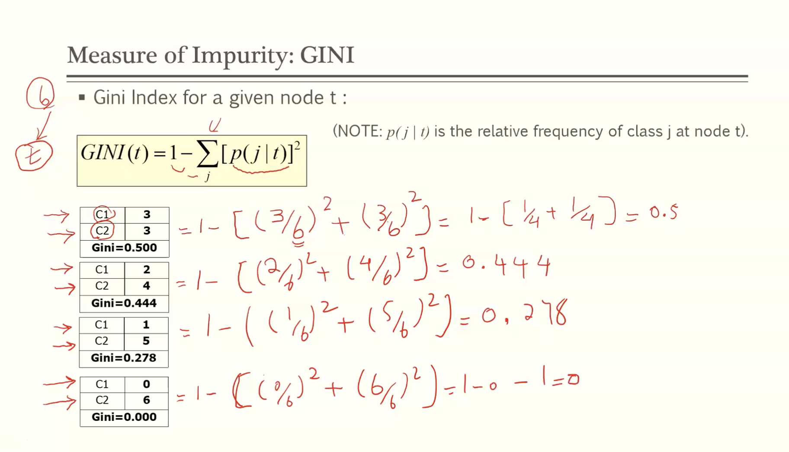
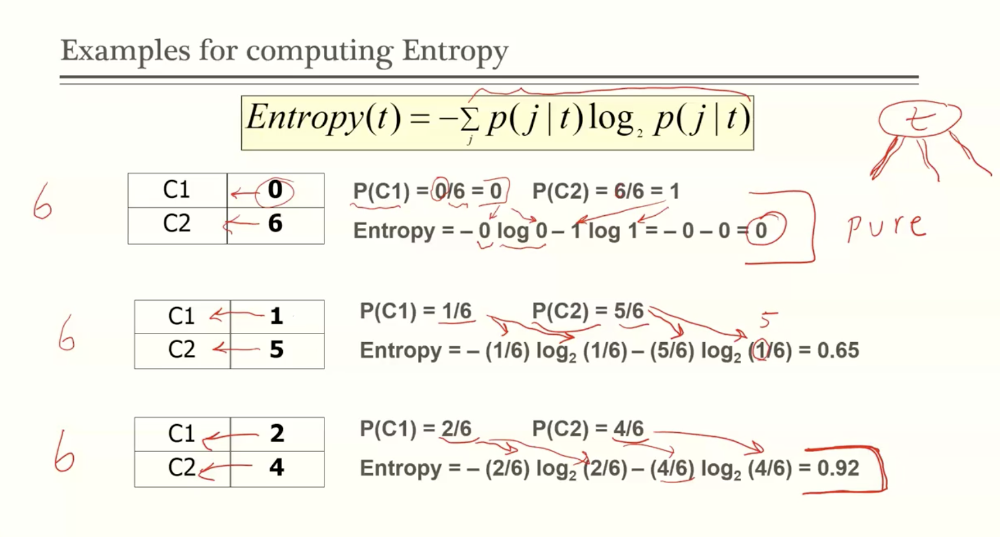
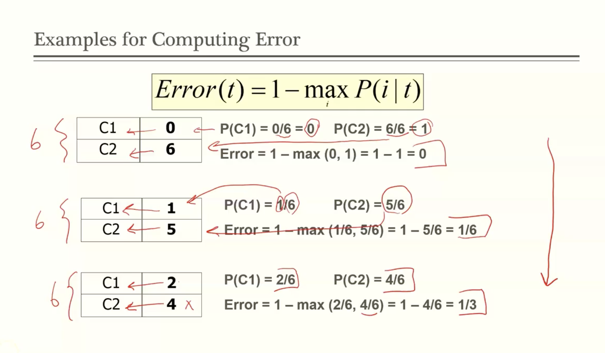

# Module 2

## Classification

- **Training set:** contains a set of records and attributes
- **class variable:** an attribute that is to be predicted
- **goal:** create a model as a 
  - function of other attributes
  - that can predict the class variable for previously unseen record of data
- **test set:** a set of records whose class variables is pretended to be unknown

### How to predict?

#### Examples

- predicting tumor cells as benign or malignant
- classifying credit card transactions as legit or fraud
- categorizing news stories

### Classification Techniques

- **decision tree**
- rule based
- memory based
- neural network
- naïve bayes and bayesian belief network
- support vector machines

### Decision Tree

**Remember: There can be more than one tree that fits the same data!**

## Decision Tree Induction

- Many algorithms
  - Hunt's algorithm
  - CARD
  - IDE, C4.5
  - SLIQ, SPRINT

### Hunt's Algorithm

- Let D_t be the set of training records that reach a node t
  - Procedure:
    - if D_t contains records that belong to the same class y_t, then t is a leaf node and labeled as y_t
    - if D_t is an empty set, then t is a leaf node labeled by the default class, y_d
    - if D_t contains records that belong to mroe than one class, use an **attribute test** to split the data into smaller subsets. Recursively apply the procedure to each subset

### Tree induction

- Greedy strategy
  - split the records based on an attribute test that optimizes certain criterion
- issues
  - determine how to split the records
    - **how to specify the attribute test condition?**
    - how to determine the best split?
  - determine when to stop splitting

## Specify test condition

- depends on attribute types
  - Nominal
    - zip code
  - ordinal
    - fail, pass
  - Continuous
    - numbers
- depends on number of ways to split
  - 2 way split
  - multi way split

### Splitting on nominal attributes

- multi way split (imagine this is a tree)
  - car type
    - family
    - sports
    - Luxury
- binary split: divide values into two subsets, needs optimal partitioning
  - car type
    - {sports, luxury}
    - {family}

### Splitting on ordinal attributes

- multi way split:
  - use as many partitions as distinct values
    - size
      - small
      - large
      - medium
- binary split: need to find optimal partioning
  - size
    - {small, medium}
    - {large}
  - size
    - {small}
    - {medium, large}
  - **note: this split is not possible, since ordinal attributes can be ordered:**
    - size
      - {small, large}
      - {medium}

### Splitting on Continuous Attributes

- different ways of handling
  - **binary** **decision** (A < v) or (A >= v)
    - consider all possible splits and find the best cut
    - can be more computationally expensive
  - **discretization** to form an ordinal categorical attribute
    - **Static**: discretize once at the beginning
    - **Dynamic**: ranges can be found by equal interval bucketing, equal freqency bucketing (percentiles), or clustering

# Measuring Impurity

## Determining the best split

You always want to split the data to end up with more pure class variable predictability.

- Greedy approach:
  - nodes with homogeneous class distribution are preferred
    - **non homogeneous (high degree of impurity)**
      - C0: 5
      - C1: 5
    - **homogeneous (low degree of impurity)**
      - C0: 9
      - C1:  1

### Measuring Impurity

#### GINI

- Gini Index for a given node t:

  - Maximum(1 - 1/n_c) records are equally distributed, least interesting information
  - Minimum (0) all records belong to one class, most interesting information

   

- When a node p is split into k partitions (children), the quality fo split is computed as
- 
  - where n_i = number of records at child i
  - n = number of records at node p

## Gini index for Continuous Attributes

- For efficient computation
  - sort the attribute on values
  - linearly scan these values, each time updating the count matrix and computing gini index
  - choose the split position that has the least gini index

## Entropy

Alternative splitting criteria based on INFO

- entropy at given node t:

  

- Note: p(j | t) is the relative frequency of class j at node t
- measures homogeneity of a node
  - minimum (0) when all records belong to one class, implying the most information
  - maximum(-1log(1/n_c)) when records are equally distributed among all classes implying least information

### Information Gain:

- Parent Node, p is split into k partitions; n_i is the number of records in partition i
- choose the split that achieves most reduction (**maximize GAIN**)

- same idea as GINI_split

## Misclassification Error

- measures misclassification error made by a node
  - minimum (0) when all records belong to one class, implying most interesting information
  - maximum(1 - 1/n_c) when records are equally distributed among classes, implying the least interesting information

## Determining when to stop splitting

- Errors	
  - **Training error:** the number/rate of records of training data that are not predicted correctly
    - there are different ways to compute training error
  - **test error/ generalization error:** the number/rate of records of test data that are not predicted correctly

- **Underfitting**: when the model is too simple, both training and test errors are large
- **Overfitting**: when model is too complex, and training error is small but test errors are large
  - noise
  - lack of sufficient data in some regions

### Addressing Overfitting

- Pre-pruning (early stopping rule)
  - stop the algorithm before it becomes a fully-grown tree
  - typically stopping conditions for a node
    - stop if all instances belong to the same class
    - stop if all the attribute values are the same
  - more restrictive conditions
    - stop if number of instances is less than some user-specified threshold
    - stop if class distribution of instances are independent of the available features
    - stop if expanding the current node does not improve impurity measures (E.g. gini or information gain)
- Post-pruning
  - grow decision tree to its entirety
  - trim the nodes of the decision tre in a bottom up fashion
    - if generalization error improves after trimming, replace sub tree by a leaf node
  - class label of leaf node is determined from majority of class of instances in the sub tree 