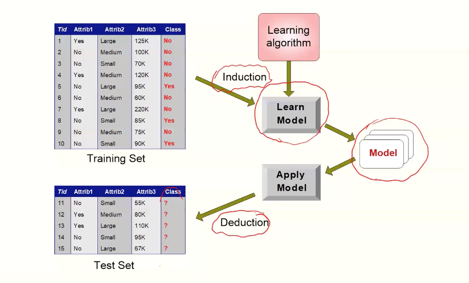
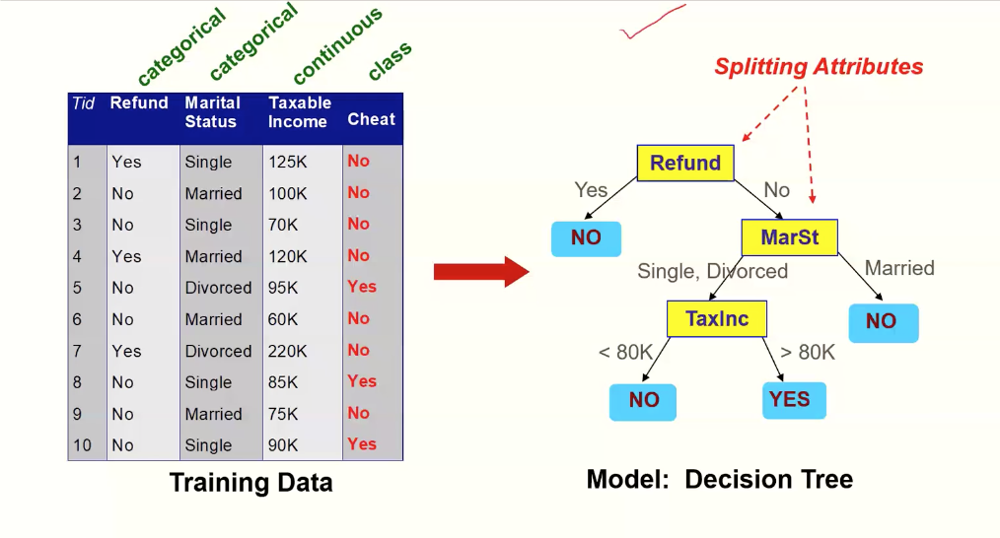

# Module 2

## Classification

- **Training set:** contains a set of records and attributes
- **class variable:** an attribute that is to be predicted
- **goal:** create a model as a 
  - function of other attributes
  - that can predict the class variable for previously unseen record of data
- **test set:** a set of records whose class variables is pretended to be unknown

### How to predict?

#### Examples

- predicting tumor cells as benign or malignant
- classifying credit card transactions as legit or fraud
- categorizing news stories

### Classification Techniques

- **decision tree**
- rule based
- memory based
- neural network
- naïve bayes and bayesian belief network
- support vector machines

### Decision Tree

**Remember: There can be more than one tree that fits the same data!**

## Decision Tree Induction

- Many algorithms
  - Hunt's algorithm
  - CARD
  - IDE, C4.5
  - SLIQ, SPRINT

### Hunt's Algorithm

- Let D_t be the set of training records that reach a node t
  - Procedure:
    - if D_t contains records that belong to the same class y_t, then t is a leaf node and labeled as y_t
    - if D_t is an empty set, then t is a leaf node labeled by the default class, y_d
    - if D_t contains records that belong to mroe than one class, use an **attribute test** to split the data into smaller subsets. Recursively apply the procedure to each subset

### Tree induction

- Greedy strategy
  - split the records based on an attribute test that optimizes certain criterion
- issues
  - determine how to split the records
    - how to specify the attribute test condition?
    - how to determine the best split?
  - determine when to stop splitting

