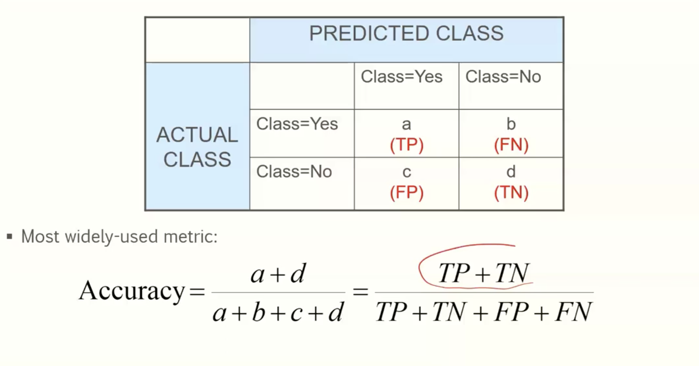
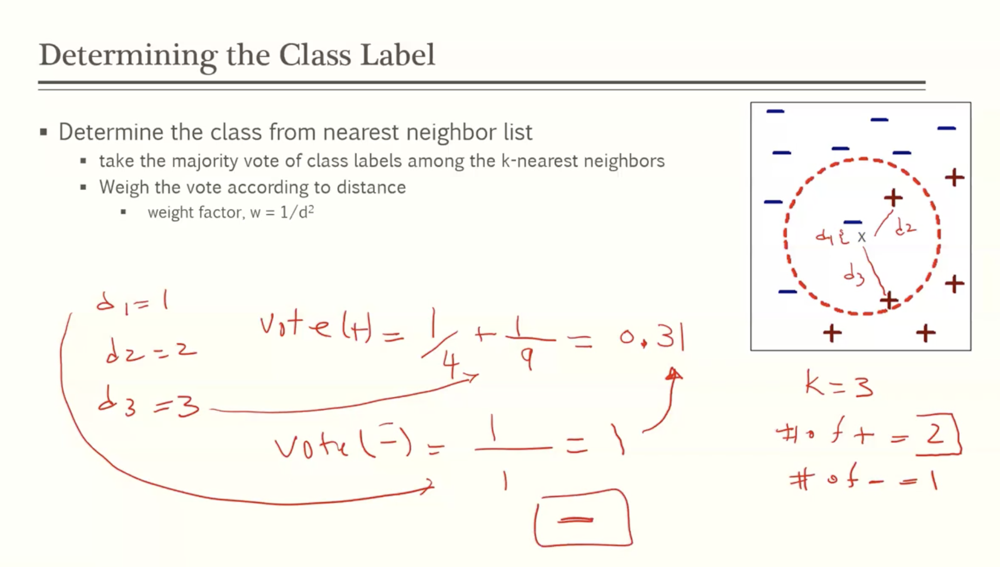

# Part 1: Selection and Evaluation of models

## Model selection

- how to choose between models
  - **using a validation set**
    - use a subset of the data for validation/testing
      - 2/3 for training and 1/3 for testing
    - the size of the training model should be larger than the validation set
    - Compare the same test data with multiple models: compare error rate
    - limitation of this approach: sensitive to the size of the data set
  - **incorporating model complexity**
    - The chance of overfitting increases as the model gets more complex
    - Occam Razor: "the simplest solution is most likely the right one"

### Generalization Error Estimation

- Dataset D, creates M model. Pick model m for instance
- **optimistic** error estimation (less likely to happen for a complex model)
  - gen.error(m) = train.error(m)
- **pessimistic** error estimation
  - gen.error(m) = train.error(m) + {alpha} * complexity(m)
    - {alpha} a hyper parameter, whose value is set berore learning
    - complexity(m) = k/N_train
      - k = leaf nodes

## Model Evaluation

### Holdout

- divide the dataset into two sets, training and testing
- 2/3 for training and 1/3 for testing
- build the model by training and test it by test data set
- measure the error using the test set
- **similar** to what was done for model selection using **validation** set
- **Limitations**
  - sensitive to size of data sets

### K-fold cross validation

- k represents the number of subsets
  - ex. k = 3, divide dataset S into {S1, S2, S3}
    - construct a model with {S1, S2}, test with {S3} to measure error e1
    - construct a model with {S2, S3}, test with {S1} to measure error e2
    - construct a model with {S1, S3}, test with {S2} to measure error e3
  - Every instance is chosen for testing once
  - every instance for model construction, k-1 times (2 for our example)
  - usually 5 <= k <= 10

## Metrics for performance evalutation

- focus on the predictive capability of a model
- **confusion matrix**
  - a = True positive
  - b = False negative
  - c = false positive
  - d = true negative

- other accuracy measurements

## Test significance

- given two models,
  - model M1: accuracy 85%, tested on 30 instances
  - Model M2: accuracy 75%, tested on 5000 instances
  - which model is better?
    - **how much confidence can we place on accuracy of M1 to be 85%?**
    - is the difference in performance measure between the two models significant?
      - or perhaps it is due to random fluctuations in the test set?

### Confidence interval for accuracy

- for large test sets (N > 30)
  - acc has normal distribution
  - for confidence level (1 - {alpha}) (i.e. 99%, 98 %, ...)

### Comparing performance of 2 models

- given two models, say M1 and M2, which is better?
  - M1 is tested on D1, size n1, found error rate e1
  - M2 is tested on D2, size n2, found error rate e2
  - assume D1 and D2 are independent
  - if n1 and n2 are sufficiently large:
    - to test if performance difference is statistically significant:
    - true difference dt = 
      - 

# Part 2 Introducing other classifiers

### Rule-based classifier

- classify records by using a collection of "if then" rules
- Rule: (condition) -> y
  - where
    - condition is a conjuction of attributes
    - y is the class label
  - examples
    - (Taxable income < 50k) AND (refund = yes) --> cheat = no
    - (blood type == warm) AND (Lays eggs == yes) --> is a bird

- A rule r **covers** an instance x if the attributes of the instance satisfy the condition of the rule

  - R1 (give birth == no) AND (can fly == yes) --> bird

    - Rule R1 covers a hawk => bird

      

### Quality of a classifier

- coverage of a rule: A -> y
  - fraction of records that satisfy the antecedent of a rule
    - coverage(r) = |A| / |D|
      - A is the number of records that satisfy the condition (dont worry about whether it was predicted correctly)
  - accuracy of a rule: fraction of records that satisfy both the antecedent and consequent
    - accuracy(r) = |A UNION Y| / |A|
      - A UNION Y -> satisfies condition and predicted correctly

### Characteristics of rule based classifier

- mutually exclusive rules
  - classifier contains mutually exclusive rules if the rules are independent of eachother
  - every record is covered at **most** once
- exhaustive rules
  - each record is covered by at least one rule

### Building classification rules

- indirect method
  - extract rules from other classification models (decision trees, neural networks)
    - e.g: C4.5rules
- Direct method
  - extract rules directly from data

### From decision tree to rules

- 

- rules created from a decision tree are **automatically mutually exclusive and exhaustive**

#### Rules can be simplified

- initial rule (refund = no) and (status = married) -> no
  - simplified rule (status = married) -> no
- However, rules may no longer be mutually exclusive
  - a record may trigger more than one rule
  - solution
    - **ordered rule set**
    - **unordered rule set - use voting scheme**

- Rules may no longer be exhaustive
  - solution: use default class value

### Ordered rule set

- rules are rank ordered according to their priority

- when test record is presented to the classifier:
  - it is assigned to the class label of the highest ranked rule it has triggered

### Rule ordering schemes

- rule based ordering
  - individual rules are ranked based on their quality
- class based ordering
  - rues that belong to the same class appear together

### Direct method: sequential covering

- 1. start from an empty rule
  2. grow a rule using the learn-one-rule function
  3. Remove training records covered by the rule
  4. repeat step 2 and 3 until stopping criteria is met

#### Aspects of sequential covering

- rule growing
- instance elimination
- rule evaluation
- stopping criterion
- rule pruning

### Rule growing

- two common strategies

  - general to specific

    - CN2 algorithm
      - start from empty conjunct {}
      - add conjuncts that minimize the entropy measure
      - determine the rule consequent by taking majority class of instances covered by the rule

  - specific to general

    

    - RIPPER algorithm
      - start from empty rule: {} => class
      - add conjuncts that maximizes FOIL's information gain measure
        - R0: {} => class (initial rule)
        - R1 {A} => class (rule after adding conjunct)
        - 

### Instance elimination

- why do we need to eliminate instances?
  - otherwise the next rule is identical to the previous rule (infinite loop)
- why do we remove positive instances
  - ensure the next rule is different
- why do we remove negative instances
  - prevent underestimating accuracy of a rule

### Rule Evaluation

### Stopping criterion and rule pruning

- stopping criterion
  - compute the gain
  - if gain is not significant, discard the new rule
- rule pruning
  - similar to post pruning of decision trees
  - reduced error pruning
    - remove one of the conjuncts in the rule
    - compare error rate on validation set before and after pruning
    - if error improves, prune the conjunct

### Advantages of rule based classifiers

- highly expressive
- easy to interpret
- easy to generate
- Can classify new instances rapidly
- performance comparable to decision trees

### Instance based classifier

- instance based classifiers are called **lazy learners**
- store training records
- use training records to predict the class label of unseen cases
- examples
  - rote-learner
    - memorizes the entire training data and perform classification only if attributes of record match one of the training examples exactly
  - nearest neighbor
    - uses k "closest" points (nearest neighbors) for performing classification

#### Nearest neighbor classifiers

- requires three things
  - the set of stored records
  - distance metric to compute distance between records
  - the value of k, the number of nearest neighbors to retreive
- to classify an unknown record
  - compute distance to other training records
  - identify k nearest neighbors
  - use class labels of nearest neighbors to determine the class label of unknown record (ex. take a majority vote)

### Distance metric

- compute the distance between two points
  - euclidian distance

### Determining the class label

- determine the class from nearest neighbor list (two options)
  - take the **majority vote** of class labels among the k-nearest neighbors
    - e.g if out of the 4 nearest neighbors, 3 are true, and 1 is false, choose true
  - weigh the vote according to distance
    - **weight factor**, w = 1/d^2
      - compute weight factor for k nearest neighbors, and choose 

#### Choosing value of k

- if k is too small, sensitive to noise points
- if k is too large, neighborhood may include points from other classes

#### Scaling issues

- attributes may have to be scaled to prevent distance measures from being dominated by one of the attributes
- 