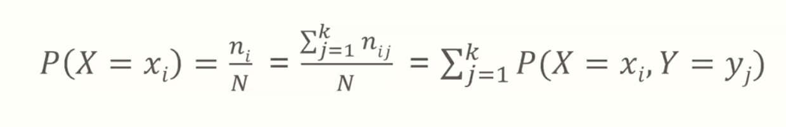
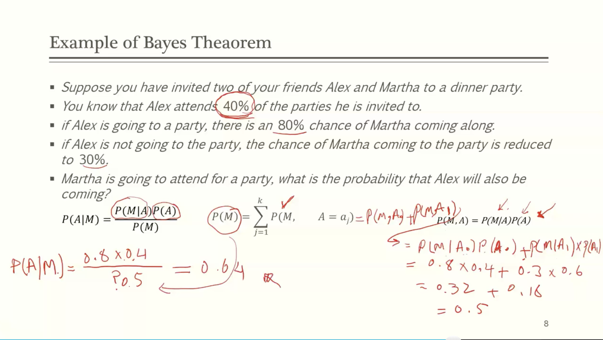
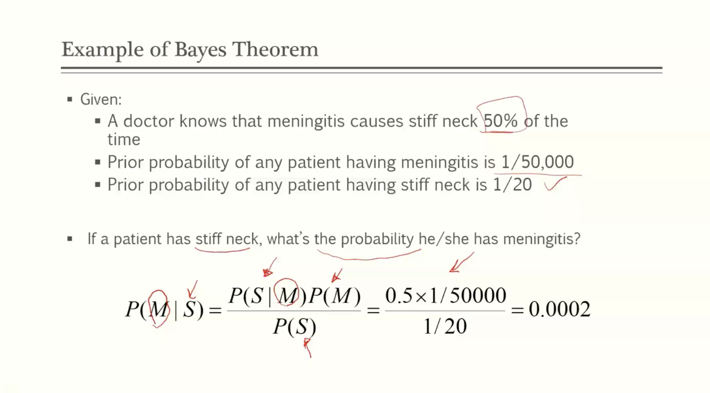
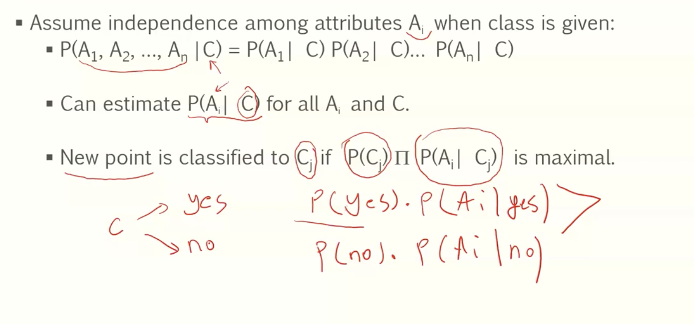
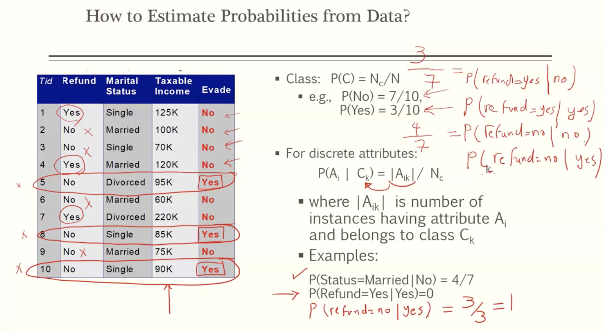
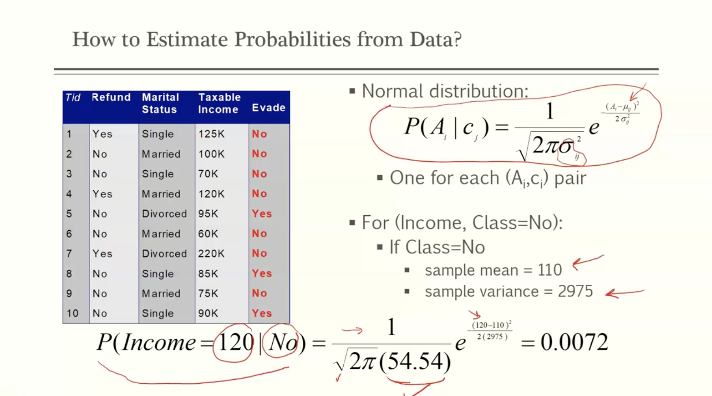
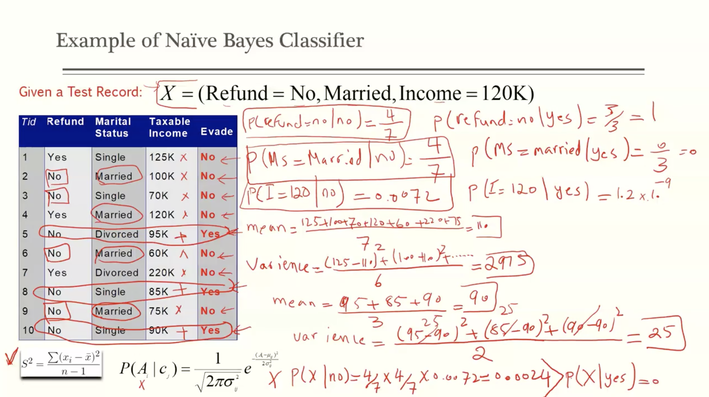
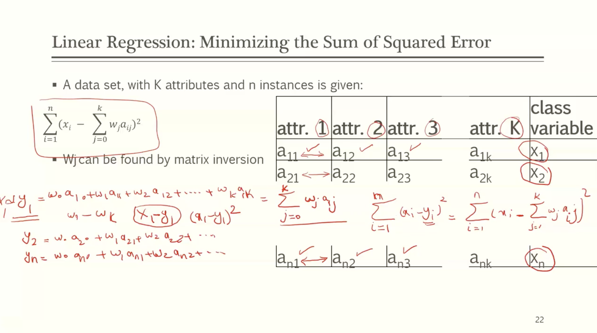
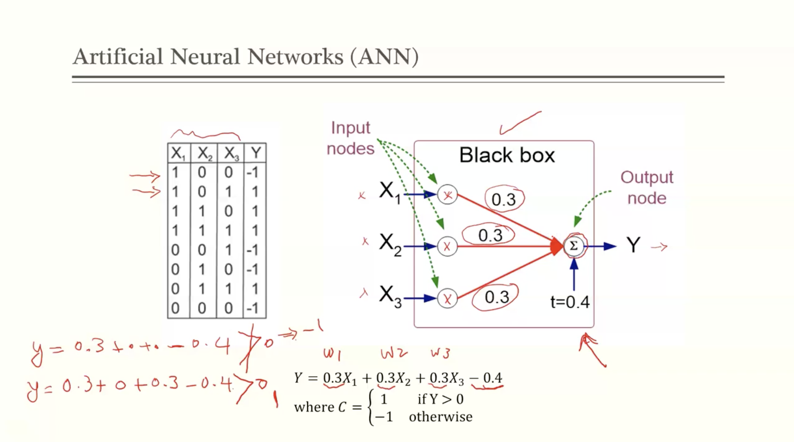
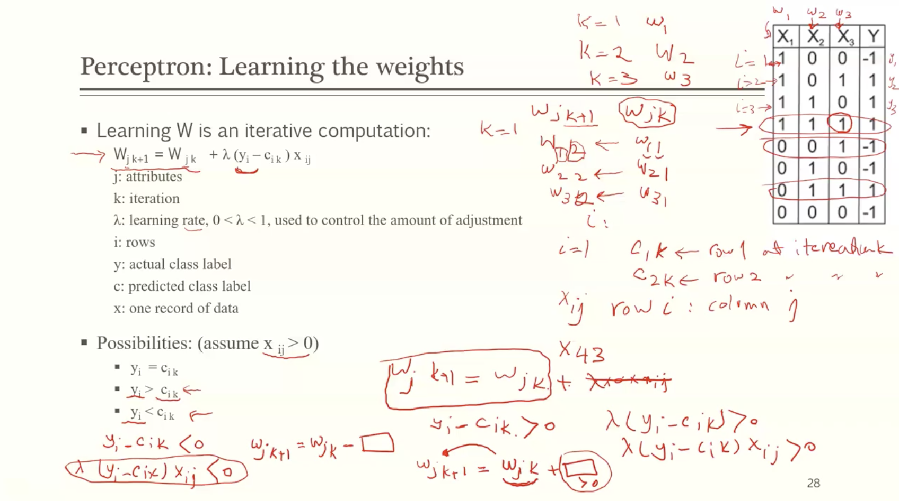

# Module 4

## Basics of probability theorey

Probability (relative frequency) is a measure that shows how likely it is that a certain event happens.

- m: the number of ocurrences of X
- n: the number of all events
- P(x) = m/n

Two random variables, x and y, each can take k discrete values

- let n_ij be the number of times we observe X = x_i and Y=y_j
- N: total number of occurrences of the event

- **joint probability** of observing xj and yj together can be estimated as
  - **P(X = xi, Y = yj) = n_ij/N**
  - if y can get k discrete values then
  - the probability of x happening of y is:
    - 

### Bayes Classifier

- Let P(C | A) denote the **conditional probability** of observing the random variable y whenever the random variable x takes a particular vlaue
  - P(C | A) = P(A, C)/P(A)
  - P(A | C) = P(A, C)/P(C)
  - therefore
  - **P(C|A) = (P(A|C) * P(C)) / P(A)**
  - 

- Consider each attribute and class label as random varaibles
  - given a record with attributes (A1, A2, ..., An)
    - goal is to predict class C
    - specifically, we want to find the value of C that maximizes P(C | A1, A2, ..., An)

- Approach
  - compute the posterior probability P(C | A1, A2, ..., An) for all values of C using the Bayes theorem
    - 
  - choose values of C that maximize
  - equivalent to choosing value of C that maximizes
  - how to estimate P(A1, A2, ..., An | C)

### Naïve bayes classifier

- 

### How to estimate probabilities from data?

- for continuous attributes

  - two way split

    - choose only one of the two splits as the new attribute

  - **probability density estimation**

    - assume attribute follows a normal distribution

    - use data to estimate parameters of distribution (mean, stdev)

    - once probability distribution is known, can use it to estimate the conditional probability (PAi | C)

      

- If one of the conditional probability is 0, then the entire expression becomes 0, use laplace to avoid

## Linear Regression

- a classification method
- borrowed from statistics
- class variable = function (attributes, attribute weight)
  - x = w0 + w1a1 + w2a2 + ... + wkak
- A0 = 1

### Minimizing the sum of squared error

### Linear regression characteristics

- simple method for numerical prediction
- statistical applications
- linearity is not always representative of dependencies between attributes
  - best fitting line minimizes error squared

## Artificial Neural Network (ANN)

- Powerful to learn highly complex and non linear decision from data
- Application: vision, speech, language processing
- shown to outperform other classification methods
- inspired by biological neural systems
- not only used for prediction, but also to extract features that are most relevant to classification

#### Perceptron: a basic type of ANN

- input nodes: represent attributes
- output node: represents class label
  - is a function of (attributes, weights, bias)
  - output is binary
  - C = 1 if WiXi + b >0
  - C = -1 otherwise
- learning goal
  - to learn Wi such taht C is as close as possible to the true class label of the instance y
  - 
  - 

### Perceptron: learning the weights

### Perceptron limitation

- only useful when two classes are linearly separable

## Multi-layer neural network

- more general form of perceptron
- is able to learn non-linear decision boundary
- input layer: dataset's attributes
  - binary and numerical attributes represented by a single node
  - categorical attributes either represented by a number of inputs for each category, by log2k inputs

- hidden layer: receives signal from input or upper hidden layer
- Output layer: gets the value from preceding layer

**this method is call feedforward NN**

### perceptron vs multi layer NN

- difference is in the inclusion of hidden layers
- what does the number of nodes in the hidden layer tell you?

### Algorithm for learning ANN

- initialize the weights (w0, w1, ..., wk) as random numbers
- adjust the weights in such a way that the output of ANN is consistent with class labels of training examples
  - find the weights wj's that minimize the objective function