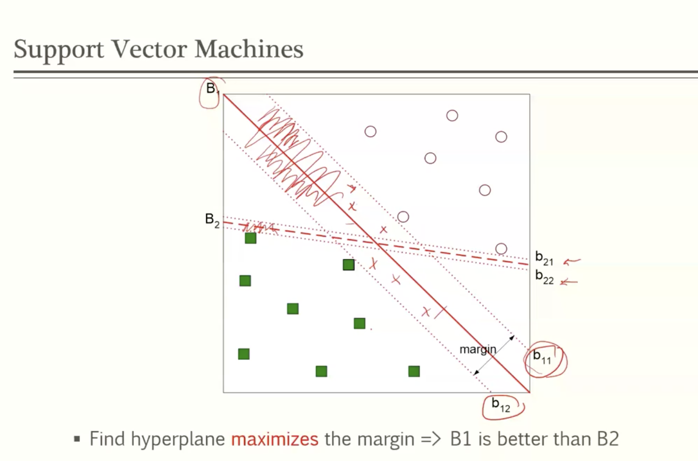
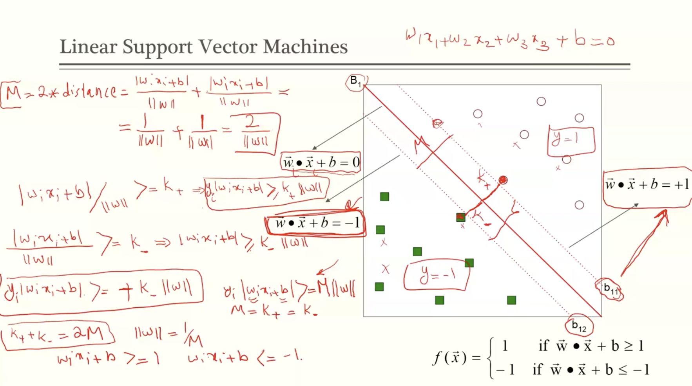
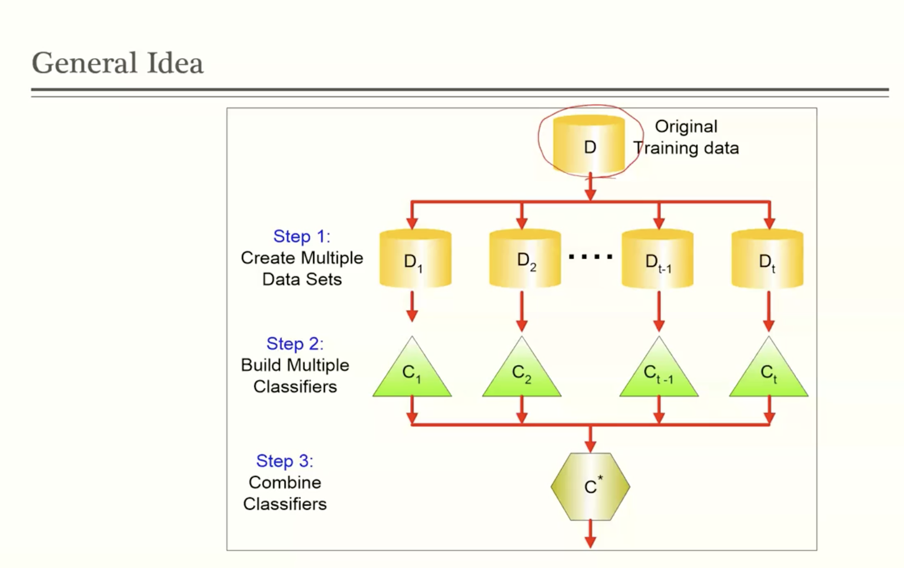
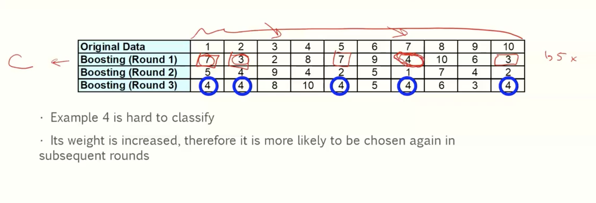
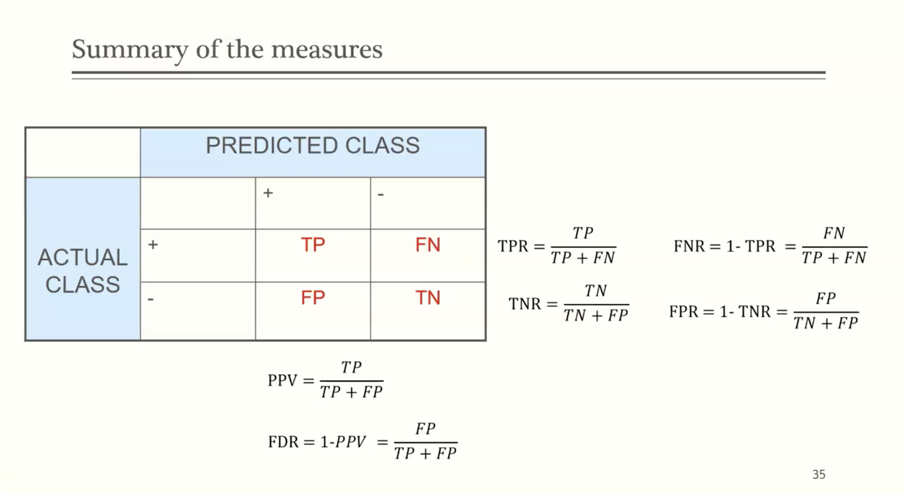
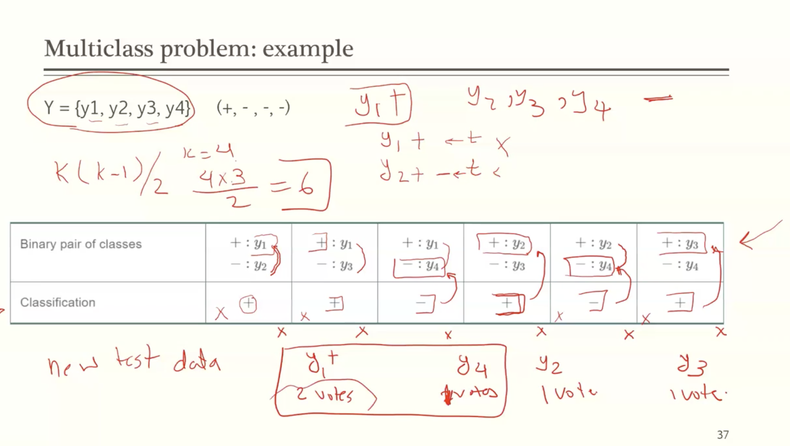

# Module 5

## Final topics in classifications

### Support Vector Machine

- a classification model that learns linear and nonlinear decision boundary
- provides a margin for good generalization error
- due to innately regularizing in learning, does not suffer from overfitting
- popular in machine learning
- uses a subset of training examples that are most difficult to classify
  - called support vectors
  - near the boundary of the classes

**How do we determine the hyperplane to distingish different classes?**

for each estimated hyperplane, you need to account for the margin. You want to pick the one with the largest margin in order to minimize errors

Goal --> find hyperplane that **maximizes** the margin

### Linear Support Vector Machine

 ### Ensemble Methods

- construct a set of classifiers from the training data
- predict class label of previously unseen records by aggregating predictions made by multiple classifiers
- give better accuracy than single classifiers

### Examples

- how to generate ensemble of classifiers
  - by manipulating the training set
    - bagging and boosting
  - manipulating the input features
    - random forset

## Bagging

also called bootstrap aggregation

- sampling with replacement
- build a classifier on each bootstrap sample
- each sample has a probability of 1 - (1-1/n)^n

## Boosting

- an iterative procedure to adaptively change distribution of training data by focusing more on previously misclassified recoreds
  - initially, all N records are assigned equal weights
- boosting algoritms differ in
  - how weight is calculated
  - how predictions are combined
- records that are wrongly classified will have their weights increased
- records that are classified correctly will have their weights decreased

### Why does it work?

- because the error rate of an ensemble method decreases compared with a siingle classifier
- suppose there are 25 base classifiers
  - each classifier has an error rate of 0.35
  - assume classifiers are independent
  - error rate can be computed by binomial probability distribution formula
  - Probability that the ensemble classifier makes a wrong prediction

### Binomial experiment

- statistical experiment that
  - consists of n repeated trial
  - each trial results in two possible outcomes
  - one outcome is a success (p), one is a failure (q)
  - the probability of success (x) is the same for every trial
  - the trials are independent
  - the binomial distribution is computed as 

## Random Forest

- ensemble of decision trees
- given a training set D consisting of n instances and d attributes
  - construct a bootstrap sample Di of the training set by randomly sampling n instances (with replacement) from D
  - use Di to learn a decision tree Ti as follows. At every internal node of Ti
    - randomly sample a set of p attributes
    - choose an attribute that shows the maximum reduction in an impurity measure of the split (gini, entropy)
    - repeat (grow the tree)
  - use voting for the prediction
- Provides significant improvements in generalization performance to ADAboost
- random forests are also more robust to overfitting and much faster

## Class Imbalance Problem

- problem of skew: disproportionate number of instances from idfferent classes
- sometimes the correct classification of the rare instances has more importance
- challenges
  - cannot find sufficient data from the rare class
  - accuracy as a measure of performance will not be reliable

### Building classifiers with class imbalance

- two techniques
  - under sampling
    - the frequency of the majority class is reduced to match the frequency of the minority class
      - shortcomings
        - loss of some useful instances
        - the possiblity of having a higher variance
  - Over-sampling
    - the frequency of the minority class is increased to match the frequency of the majority class
      - duplication: # of majority / # of minority class

## Evaluation Measures

- Accuracy 
- true positive
  - TPR = TP/TP+FN
- True negative rate (specificity)
  - TNR = TN/TN+FP
- False Positive Rate
  - 1-TNR = FP/TN+FP
- False Negative rate
  - FNR = 1 - TPR = FN/TP+FN

**Precision: aka positive predicted value (PPV**

PPV = TP/TP+FP

**False Discovery Rate: FDR**

FDR = 1-PPV = FP/TP+FP

When you have skewed data, these measures will vary highly

## Multiclass Problem

- some of the classification techniques are designed for binary classification
- real world data are not necessarily binary
- solutions
  - one against rest (1 - r) approach
  - One against one (1-1) approach
- in both approaches, a test instance is classified by combining the predictions made by the binary classifiers

#### Example

y = {}