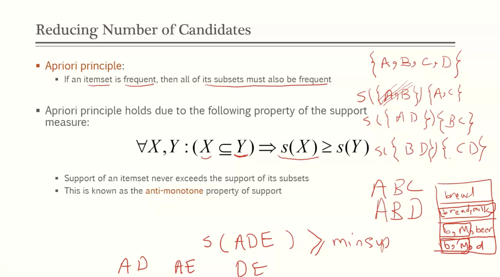
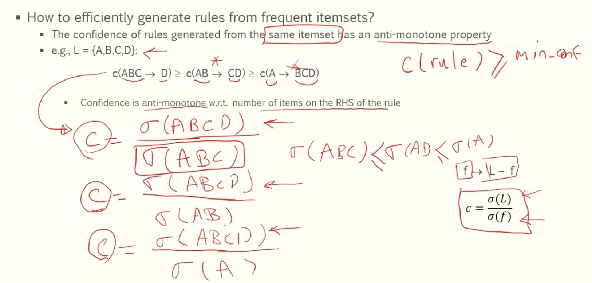

# Module 6

## Association analysis

### Association rule mining

- given a set of transactions, find rules that will predict the occurence of an item based on the occurrences of other items in the transactions
- 

### Definition frequent itemset

- itemset
  - a collection of one or more items
    - ex. {milk, bread, coke}
  - k-itemset
    - an itemset that contains k items

- Support count
  - frequency of occurence of an itemset
  - ex.
    - support({milk, diaper}) = ...
- support
  - fraction of transactions that contain itemset
- frequent itemset
  - an itemset whose support is greater than or equal to a minsup threshold

### Definition association rule

- association rule
  - an implication expression of the form x -> y where x and y are itemsets
- rule evaluation metrics
  - support: s
    - fraction of transactions that contain both x and y
  - confidence (c)
    - measures how often item y appears in transactions that contain x
- 

## Association rule mining task

- given a set of transactions T, the goal of association rule mining is to find all rules having
  - support >= minsup threshold
  - confidence >= minconf threshold
- **Brute-force approach**
  - list all possible association rules
  - compute the support and confidence for each rule
  - prune rules that fail the minsup and minconf thresholds
  - *computationally prohibitive*
- **two step approach**
  - 1. frequent itemset generation
       - generate all itemsets whose support >= minsup
    2. rule generation
       1. generate high confidence rules from each frequent itemset where each rule is a binary partitioniing of a frequent itemset
  - frequent itemset generation is still computationally expensive

### Frequent Itemset generation

- **brute force approach**
  - each itemset in the lattice is a **candidate** frequent itemset
  - count the support of each candidate by scanning the database
  - match each transaction against every candidate
  - Complexity ~ O(NMw) -> expensive since M = 2^d

#### Generation strategies

- **reduce the number of candidates (M)**
  - complete search M = 2^d
  - use pruning techniques
- **reduce the number of transactions (N)**
  - reduce size of N as the size of itemset increases
  - used by DHP and vertical based mining algorithms
- **Reduce the number of comparisons (NM)**
  - use efficient data structures to store candidates or transactions
  - no need to match every candidate against every transaction

### Reducing the number of candidates

### Apriori Algorithm

- method
  - let k = 1
  - generate frequent itemsets of length 1
  - repeat until no new frequent itemsets are identified
    - generate length (k+1) candidate itemsets from length k frequent itemsets
    - count the support of each candidate by scanning the DB
    - eliminate candidates that are infrequent, leaving only those that are frequent

### Reducing the number of comparisons

- candidate counting
  - scan the database of transactions to determine the support of each candidate itemset
  - to reduce the number of comparisons, store candidates in a hash structure
    - instead of matching each transaction against every candidate, match it against candidates contained in the hashed buckets
    - 

### compact representation of frequent itemsets

- maximal frequent itemset
  - an itemset is maximal frequent if none of its immediate supersets are frequent

- closed itemset
  - an itemset is closed if none of its immediate supersets has the same support as the itemset

## FP growth algorithm

- an alternative way to create frequent itemset
- use a compressed representation of the database using an FP-tree
- Once an FP-tree has been constructed, it uses a recursive divide and conquer approach to mine the frequent itemsets
- 

## Mining association rules

- given a frequent itemset L, find all non-empty subsets f subset L suth that f -> L - f satisfies the minimum confidence requirement
- 

### Rule generation

- how to efficiently generate rules from frequent itemsets
  - the confidence of rules generated from the same itemset has an anti-monotone property
    - e.g. L = {a,b,c,d}
      - c(abc->d)>= c(ab->cd) >= c(a->bcd)
    - confidence is antimonotone w.r.t. number of items on the rhs of the rule

### Effect of support distribution

- how to set the appropriate minsup threshold
  - if minsup is set too high, we could miss itemsets involving interesting rare items
  - if minsup is set too low, it is computationally expensive and the number of itemsets is very large
- using a single minimum support threshold may not be effective
- 