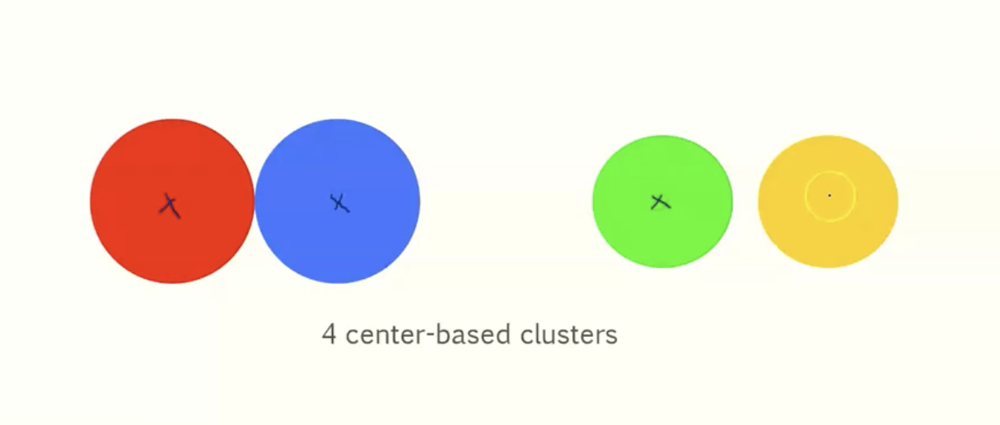
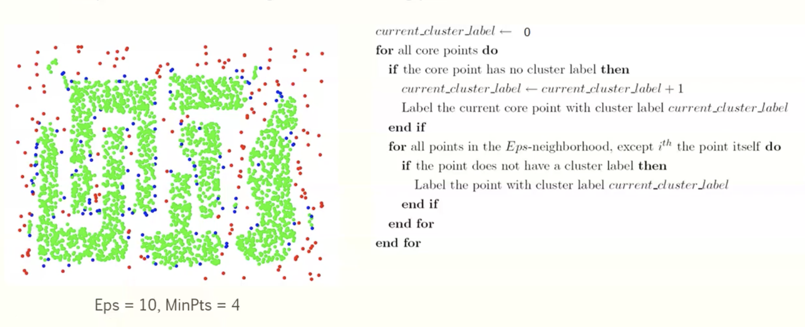

# Module 7 Cluster analysis

## What is cluster analysis

- finding groups of objects such that the objects in a group will be similar to one another or different from the objects in other groups
  - intra cluster distance minimized
  - Inter cluster distance maximized

### Applications

- **understanding**
  - group related documents for browsing, group genes and proteins that have similar functionality, or group stocks with similar price fluctuations.
- **summarization**
  - reduce the size of large data sets

### What cluster analysis is NOT:

- supervised classification
  - have class label information
- simple segmentation
  - dividing students into different registration groups alphagetically, by last name
- results of a query
  - groupings are a result of an external specification

### Notion of a cluster can be ambiguous

## Types of clustering

- a clustering is a set of clusters

- important distincting between **hierarchical** and **partitional** sets of clusters

  - partitional
    - a division data objects into non overlapping subsets (clustters) such that each data object is in exactly one subset
  - hierarchical
    - a set of nested clusters organized as a hierarchical tree

  ### other distinctions between sets

  - **Exclusive vs non exclusive**
    - in non-exclusive clusterings, points may belong to multiple clusters
    - can represent multiple classes or border points
  - **fuzzy vs non fuzzy**
    - in fuzzy clustering, a point belongs to every cluster with some weight between 0 and 1
    - weights must sum to 1
    - probabilistic clustering has similar characteristics
  - **partial vs complete**
    - in some cases we only want to cluster some data
  - **heterogeneous vs homogeneous**
    - cluster of widely different sizes, shapes, and densities

## Well seperated clusters

- a cluster is a set of points such that any point in a cluster is closer to every other point in the cluster than to any point not in the cluster

## Center Based Clusters

- a cluster is a set of objects such taht an object in a cluster is closer to the **center** of a cluster than to the center of any other cluster
- the center of a cluster is often a **centroid** the average of all the points in the cluster, or a **medoid**: the most "representative point of a cluster

## Densitiy based clustering

- a cluster is a ddense region of pints, which is separated by low density regions from other regions of high density
- Used when the clusters are irregular or intertwined and when noise and outliers are present

### 

## K means clustering

- partitional clustering approach
- each cluster is associated with a **centroid**
- each point is assigned to the cluster with the closest centroid
- number of clusters, k must be specified

### details

- initial centroids are often chosen randomly
  - clusters produced vary from one run to another
- the centroid is (typically) the mean of the points in the cluster
- 'closeness' is measured by euclidean distance, cosine similarity, correlation, etc.
- k-means will converge for common similarity measures mentioned above
- most of the convergence happens in the first few iterations
  - often stopping condition is changed to 'until relatively few points change clusters'
- **complexity** is O(n * K * i * d)
  - n = num points
  - k = num clusters
  - i = num iterations
  - d = num attributes

### two different k-means clustering

### Evaluating k means clusters

- most common measure is sum of squared error (SSE)
  - for each point, the error is the distance to the nearest cluster
  - to get SSI we square the errors and sum them
  - 

- given two culsters we can choose the one with the smallest error
- one easy way to reduce sse is to increase k, the number of clusters
  - a good clustering with a smaller k can have a lower sse than a poor clustering with a higher k

## Solutions to initial centroids problem

- multiple runs
  - helps, but probability is not on your side
- sample and use hierarchical clustering to determine initial centroids
- select more than k initial centroids and then select among these initla centroids
  - select mose widely seperated
- postprocessing
  - eliminate small clusters that may represent outliers aand also empty clusters
  - split loose clusters, i.e., clusters with relatively high SSE
  - merge clusters that are close and have relatively low SSE
- bisecting k means
  - not as susceptible to initialization issues

## limitations of k-means

- k means has problems when clusters are of differing
  - sizes
  - densities
  - Non-globular shapes
- k means has problems with data that contains outliers

### overcoming k means limitations

- one solution is to use many clusters.
  - find parts of clusters and put them together

## Hierarchical clustering

- produces a set of nested clusters organized as a hierarchical tree
- can be visualized as a dendogram
  - a tree like diagram that records the sequences of merges or splits

### Strengths

- do not have to assume any particular number of clusters
  - any desired number of clusters can be obtained by 'cutting' the dendogram at the proper level
- they may correspond to meaningful taxonomies
  - examples in biological sciences (**animal kingdom**)

### two main types of hierarchical clustering

- **agglomerative**
  - start with the points as individual clusters
  - at each step, merge the closest pair of clusters until only one cluster (or k clusters) are left
- **divisive**
  - start with one, all-inclusive cluster
  - at each step, split a cluster until each cluster contains a point (or k clusters)

- traditional hierarchical algorithms use a similarity or distance matrix
  - merge or split one cluster at a time

### agglomerative clustering algorithm

## cluster similarity: MIN or single link

- similarity of two clusterrs is based on the two most similar points in the different clusters
  - determined by one pair of points, i.e. by one link in the proximity graph

- min cannot handle non-eliptical shapes

## cluster similarity: MAX or complete linkage

- similarity of two clusters is based on the two least similar (most distant) points in the different clusters
  - determined by all pairs of points in the two clusters
- Strengths:
  - less susceptible to outliers
- weaknesses
  - tends to break large clusters
  - biased towards globular clusters

## cluster similarity: group average

- proximity of two clusters is the average of pairwise proximity between points in the two clusters

- need to use average connectivity for scalability since total proximity favors large clusters
- 

- compromise between single and complete link
- strengths
  - less susceptible to noise and outlers
- Weaknesses
  - biased towards globular clusters

### time and space requirements

- O(n^2) space since it uses a proximity matrix
  - where n is the number of points
- O(n^3) time in many cases
  - there are n steps and  at each step the size, n^2, proximity matrix must be updated and searched
  - Complexity can be reduced to O(n^2 log(n)) time for some approaches

## DBSCAN

- density based algorithm
  - density = number of points within a specified radius EPS
  - a point is a **core point** if it has more than a specified number of points (minpts) within EPS
    - these are points that are at the interior of a cluster
  - a border point has fewer than minpts within IPS, but is in the neighborhood of a core point
  - a noise point is any point that is not a core point or a border point

### algorithm

1. label all nodes by core, border, or noise
2. eliminate noise points
3. perform clustering on the remaining points

### when DBSCAN works well

- resistant to noise
- can handle clusters of different shapes and sizes

### when DBSCAN WONT work well

- varying densities
- high dimensional data

